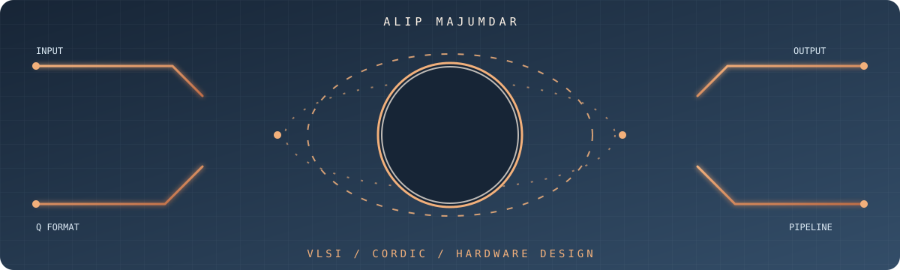
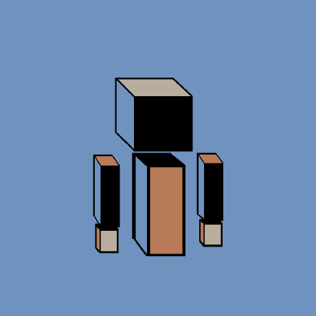
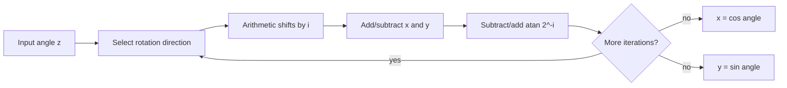
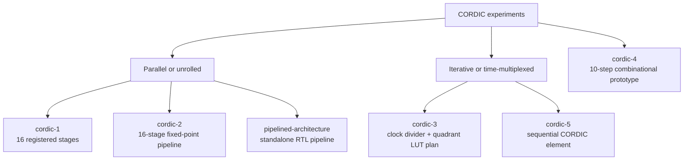
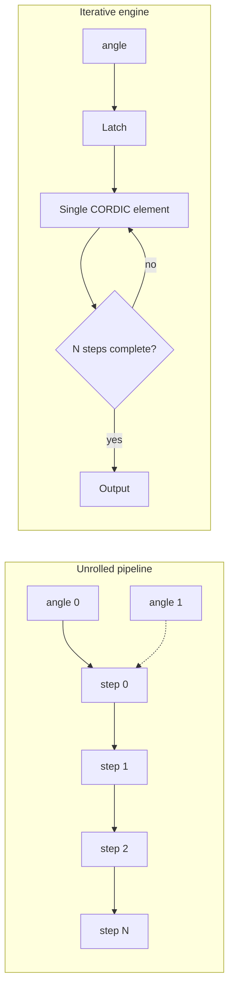

<p align="center">
	
</p>

<p align="center">
	
</p>

<p align="center">
	<strong>Mtech(R), VLSI, IIT Mandi</strong><br />
	Hardware experiments from CORDIC arithmetic to pipelined RTL.
</p>

# CORDIC Algorithm and Hardware Design

This repository collects several generations of a hardware CORDIC (COordinate
Rotation DIgital Computer) design. The projects explore the same core idea at
different points in the design space: unrolled pipelines, iterative engines,
quadrant handling, fixed-point angle formats, clock control, and simulation in
Xilinx Vivado.

The repository is intentionally organized as independent experiments. Each
directory retains the source layout and history of its original repository.
The root README is the map between them; the child READMEs are currently only
project labels.

## Project Map

| Directory | Main design | Architecture | Useful starting point |
| --- | --- | --- | --- |
| [`cordic-1`](cordic-1/) | `sine_cosine` | 16-stage registered pipeline with quadrant pre-rotation | [`wave_gen.v`](cordic-1/sources_1/new/wave_gen.v) |
| [`cordic-2`](cordic-2/) | `wave_generator` | 16-stage fixed-point pipeline, Vivado project | [`wave_generator.v`](cordic-2/CORDIC2.srcs/sources_1/new/wave_generator.v) |
| [`cordic-3`](cordic-3/) | `CORDIC1` plus clock divider | Iterative engine with master/slave clocks and quadrant/LUT plan | [`cordic1.v`](cordic-3/CORDIC3.srcs/sources_1/new/cordic1.v) |
| [`cordic-4`](cordic-4/) | `cordic` | Small 10-iteration combinational experiment | [`wave.v`](cordic-4/CORDIC4.srcs/sources_1/new/wave.v) |
| [`cordic-5`](cordic-5/) | `cordic_element` | Sequential 16-iteration element | [`cordic_element.v`](cordic-5/CORDIC5.srcs/sources_1/new/cordic_element.v) |
| [`pipelined-architecture`](pipelined-architecture/) | `CORDIC` | Standalone parameterized Verilog pipeline and testbench | [`cordic_pipeline.v`](pipelined-architecture/cordic_pipeline.v) |

## What CORDIC Computes

In rotation mode, CORDIC starts with a vector on the positive x-axis and
rotates it toward an input angle. At iteration $i$, multiplication by a power
of two is replaced by an arithmetic shift:

```text
x(i+1) = x(i) - d(i) * (y(i) >>> i)
y(i+1) = y(i) + d(i) * (x(i) >>> i)
z(i+1) = z(i) - d(i) * atan(2^-i)
```

The direction $d(i)$ is selected from the sign of the residual angle `z`.
After enough iterations, `x` and `y` approximate cosine and sine multiplied by
the CORDIC gain. The designs compensate for that gain by choosing a scaled
initial x value, commonly approximately $K \approx 0.607252$, so that the
outputs have unit magnitude.



## Architectural Progression



### Pipeline versus iterative hardware

An unrolled pipeline has one CORDIC step per stage. Once full, it can accept a
new angle every clock, at the cost of registers and duplicated add/shift logic.
An iterative design reuses one CORDIC element over many clock cycles. It uses
less hardware, but each result takes multiple cycles and needs input/output
control.



## Directory Details

### `cordic-1`: quadrant-aware 16-stage pipeline

The `sine_cosine` module in
[`cordic-1/sources_1/new/wave_gen.v`](cordic-1/sources_1/new/wave_gen.v)
uses a 32-bit phase accumulator representation. The upper two phase bits
identify the quadrant. Quadrants outside the basic CORDIC convergence range
are pre-rotated before the 16 registered iterations. Its arctangent table
contains 31 entries, although the generated pipeline uses 16 stages.

The testbench in
[`cordic-1/sim_1/new/waveGEN_test.v`](cordic-1/sim_1/new/waveGEN_test.v)
drives angles from 0 through 359 degrees and initializes the vector with a
gain-compensated value (`32000 / 1.647`).

### `cordic-2`: fixed-point wave generator

The Vivado project is in [`cordic-2/CORDIC2.xpr`](cordic-2/CORDIC2.xpr) and is
configured for Vivado 2019.2 and an `xc7z010clg400-1` part. The design uses:

- `M = 22` bits for x/y data.
- `N = 16` bits for the angle and 16 micro-rotations.
- A 16-entry arctangent table in approximately Q1.15 angle format.
- An initial x value `K = 0x0DBD96`, described in the source as approximately
  `0.8588` in Q2.20.
- A registered pipeline and a simulation testbench that writes output samples
  to `wave_data.txt`.

The top-level project source is
[`clock_control_unit.v`](cordic-2/CORDIC2.srcs/sources_1/new/clock_control_unit.v),
while the numerical generator is
[`wave_generator.v`](cordic-2/CORDIC2.srcs/sources_1/new/wave_generator.v).
The clock-control module is present in the project, but the wave-generator
pipeline is the clearest standalone numerical implementation.

### `cordic-3`: iterative engine and clocking experiment

This version moves toward resource sharing. The main module
[`CORDIC1`](cordic-3/CORDIC3.srcs/sources_1/new/cordic1.v) performs one
iteration per `slave_clk` edge, stores intermediate x/y/angle values, and uses
25-bit angle inputs with quadrant information in bits `[24:23]`.

Supporting files include:

- [`cordic_master_clock.v`](cordic-3/CORDIC3.srcs/sources_1/new/cordic_master_clock.v),
  which divides the slave clock for slower control events.
- [`theta_input_latch.v`](cordic-3/CORDIC3.srcs/sources_1/new/theta_input_latch.v),
  which provides an enabled angle latch.
- [`wave_GEN.v`](cordic-3/CORDIC3.srcs/sources_1/new/wave_GEN.v),
  which contains an earlier pipelined generator and extensive design notes for
  first-quadrant lookup and quadrant inversion.

The source demonstrates the intended control strategy, but the quadrant paths
and LUT bookkeeping should be treated as experimental until re-simulated and
reviewed. In particular, the first-quadrant tables are declared but not fully
populated in the current RTL.

### `cordic-4`: compact combinational prototype

[`cordic-4/CORDIC4.srcs/sources_1/new/wave.v`](cordic-4/CORDIC4.srcs/sources_1/new/wave.v)
implements a 10-iteration combinational CORDIC with 11-bit angles and
17-bit x/y values. It uses a fixed initial x value representing approximately
`0.60725` and prints intermediate values when `OPT_SIMULATE` is enabled.

This is useful as a small reference experiment, not as the repository's
preferred production implementation. The current prototype has no clocked
interface, and its array bounds and simulation macro should be checked before
using it as synthesis-ready RTL.

### `cordic-5`: sequential CORDIC element

[`cordic-5/CORDIC5.srcs/sources_1/new/cordic_element.v`](cordic-5/CORDIC5.srcs/sources_1/new/cordic_element.v)
implements one CORDIC element that advances on a clock and emits a result after
the iteration counter reaches 15. It uses a 25-bit angle, 24-bit output
registers, and a 16-entry arctangent table. The companion testbench sends a
sequence of angles and records binary cosine/sine output in `theta_val.txt`.

The module is a useful sequential baseline, but it currently relies on
initialization rather than an explicit reset or valid/ready handshake. It also
assumes the caller observes the iteration schedule correctly.

### `pipelined-architecture`: standalone pipeline

The standalone [`CORDIC`](pipelined-architecture/cordic_pipeline.v) module is
the easiest entry point for studying the pipeline implementation without
opening a Vivado project. Its parameters are:

```text
M = 22       x/y width
N = 16       angle width and iteration count
K = 0x0DBD96 initial gain-compensated x value
```

It contains an arctangent table, combinational CORDIC step tasks, and clocked
x/y/angle pipeline registers. The testbench
[`cordic_pipeline_test.v`](pipelined-architecture/cordic_pipeline_test.v)
drives angles from approximately `-0.9` to `0.9` in fixed-point units and
writes sampled outputs to `monitor.txt`.

The `rst_n` port is declared in the current RTL but is not used by the
sequential block. Treat reset behavior as a follow-up item before integrating
this module into a larger design.

## Fixed-Point and Angle Conventions

The projects do not use one universal numeric format. Always inspect the
selected module and its testbench together.

| Design | Angle representation | x/y representation | Quadrant handling |
| --- | --- | --- | --- |
| `cordic-1` | 32-bit phase, upper 2 bits encode quadrant | 16-bit input, 17-bit stage/output | Pre-rotation before iteration 0 |
| `cordic-2` | 16-bit signed angle, source comments describe Q1.15 | 22-bit signed pipeline | Sign-driven rotation; input range is constrained by the implementation |
| `cordic-3` | 25-bit angle, bits `[24:23]` used for quadrant | 16-bit signed state/output | First-quadrant computation plus planned lookup/inversion |
| `cordic-4` | 11-bit angle | 17-bit state/output | No explicit quadrant pre-rotation in the prototype |
| `cordic-5` | 25-bit angle, quadrant bits reserved | 16-bit internal state and 24-bit output | First-quadrant sequential path is implemented; other paths are experimental |
| `pipelined-architecture` | 16-bit signed angle, arctangent table in Q1.15-style values | 22-bit signed state/output | Sign-driven rotation |

The angle input must be encoded in the same scale as the arctangent table. A
bit pattern that means a radian fraction in one project may represent a full
turn phase in another.

## How to Explore the Designs

### Vivado projects

Open these project files with the matching Vivado release or migrate them in a
copy:

```text
cordic-2/CORDIC2.xpr
cordic-3/CORDIC3.xpr       (if present in your local Vivado checkout)
cordic-4/CORDIC4.xpr       (if present in your local Vivado checkout)
cordic-5/CORDIC5.xpr       (if present in your local Vivado checkout)
```

The merged repositories contain generated `.sim`, `.cache`, and project
metadata from previous Vivado runs. Regenerating simulation products is often
cleaner than relying on those machine-generated files.

### Standalone Verilog simulation

The standalone project requires a Verilog simulator such as Icarus Verilog,
Verilator, or Vivado XSim. For Icarus Verilog, from the repository root:

```bash
iverilog -g2012 -o /tmp/cordic_pipeline.out \
  pipelined-architecture/cordic_pipeline.v \
  pipelined-architecture/cordic_pipeline_test.v
vvp /tmp/cordic_pipeline.out
```

The testbench writes `monitor.txt` in the simulator's working directory. The
command has not been added as a repository build target; it is a quick
exploration command and may require simulator-specific adjustments.

## Recommended Reading Order

1. Read [`pipelined-architecture/cordic_pipeline.v`](pipelined-architecture/cordic_pipeline.v)
	for the compact pipelined datapath.
2. Compare it with [`cordic-1/sources_1/new/wave_gen.v`](cordic-1/sources_1/new/wave_gen.v)
	to see explicit quadrant pre-rotation and a wider phase representation.
3. Open [`cordic-2/CORDIC2.xpr`](cordic-2/CORDIC2.xpr) to see the Vivado project
	organization and simulation setup.
4. Study [`cordic-5/CORDIC5.srcs/sources_1/new/cordic_element.v`](cordic-5/CORDIC5.srcs/sources_1/new/cordic_element.v)
	and [`cordic-3/CORDIC3.srcs/sources_1/new/cordic1.v`](cordic-3/CORDIC3.srcs/sources_1/new/cordic1.v)
	for sequential reuse and clock/control experiments.
5. Use [`cordic-4/CORDIC4.srcs/sources_1/new/wave.v`](cordic-4/CORDIC4.srcs/sources_1/new/wave.v)
	as a small combinational algorithm reference.

## Integration and Improvement Roadmap

The most useful next engineering steps are:

1. Choose and document one canonical angle and amplitude fixed-point format.
2. Add explicit reset, input-valid, and output-valid signals to the selected
	reusable module.
3. Add a self-checking testbench against software `sin()` and `cos()` values,
	including quadrant boundaries and zero.
4. Decide whether the product target is throughput (pipeline) or area/energy
	(iterative engine).
5. Remove or regenerate machine-specific Vivado outputs and add a reproducible
	project or simulator script.
6. Add synthesis timing, resource utilization, latency, and numerical-error
	measurements before selecting a final architecture.

## Repository Notes

- The merged child directories are separate experiments, not a single
  drop-in-compatible IP library.
- Several modules use Verilog `initial` blocks for state initialization and do
  not expose reset. FPGA behavior may depend on the target technology and
  synthesis flow.
- Generated simulation databases and logs are retained from the original
  projects for historical context; they are not substitutes for a fresh
  simulation.
- Check each module's signedness and fixed-point scaling before connecting it
  to another project's testbench.